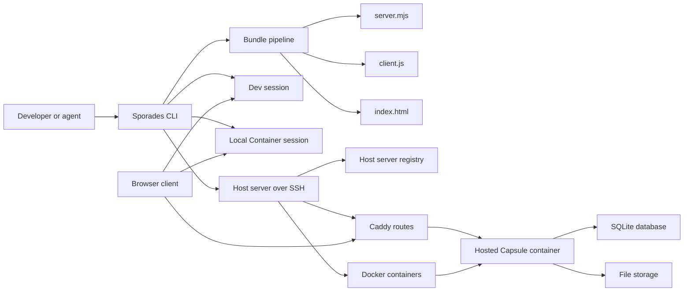

# Sporades Architecture

Sporades is an Agent-first hosting platform for rapid deployment and iteration.
Its core bet is that developers and agents should be able to create, run,
inspect, and publish full-stack web Capsules through deterministic commands,
without dashboards, bespoke runtime wiring, or hidden build steps.

The platform is deliberately small at the authoring surface:

```sh
sporades create my-capsule
sporades dev
sporades deploy
sporades host push --restart
```

Behind those commands, Sporades bundles application code, runs it in a
predictable Node runtime, persists state in SQLite and file storage, and routes
Hosted Capsule traffic through Caddy.

## Ethos

Sporades is designed for fast loops, scriptable operation, and clear ownership
boundaries.

- Agents are first-class users. Commands avoid interactive prompts, support
  `--json` where useful, and return actionable error hints.
- Bundled code is the unit of execution. Dev sessions, local Container sessions,
  and Hosted Capsules run the same server and client Bundles.
- Runtime plumbing is platform-owned. App authors define schema, queries,
  mutations, endpoints, messages, and UI; Sporades owns transport, auth,
  routing, upload negotiation, database setup, and release packaging.
- Capsules are portable. A Capsule is still a real Node server plus static
  client assets, not an interpreted sandbox.
- Hosted infrastructure stays boring. Docker runs Capsules, Caddy routes HTTP
  and WebSocket traffic, SQLite stores app state, and the filesystem stores file
  bytes.

## System Overview



At every runtime layer, the Capsule shape is the same. The canonical file and
mount layouts live in [runtime-layout.md](./runtime-layout.md); this document
describes how those pieces relate.

Conceptually, each runtime contains:

- `server.mjs`: the bundled server runtime and Capsule definition.
- `client.js`: the bundled browser client.
- `index.html`: user-owned HTML shell.
- `sporades.json`: project configuration read by the CLI and passed into the
  runtime.
- Sealed Server env: encrypted server-only values mounted or loaded outside the
  client Bundle and exposed through `ctx.env`.
- persistent data: SQLite database plus file bytes.

## Capsule Model

A Capsule is the deployable unit of Sporades. It combines:

- a server Bundle,
- a client Bundle,
- app configuration,
- Server env,
- a SQLite database,
- file storage,
- and the process/container that serves it.

The app author defines the Capsule in `server/index.ts` with `capsule()`:

```ts
export default capsule({
  name: "team-notes",
  schema: {},
  queries: {},
  mutations: {},
  endpoints: {},
  messages: {},
});
```

`capsule()` is an initialization boundary, not a passive object literal. It
registers schema, wires the table API, configures auth, prepares platform tables,
and makes the Capsule available to the HTTP and WebSocket runtime.

## Bundle Pipeline

Sporades always bundles, even in dev. The CLI reads the project root, then uses
the bundle pipeline to produce the project-local runtime files described in
[Project Runtime Directory](./runtime-layout.md#project-runtime-directory).

The server Bundle targets Node ESM. The client Bundle targets the browser and
uses the JSX framework declared in `sporades.json`.

This removes the usual split between a development path and a production path.
When a Capsule works in a Dev session, the same bundled server and client code
are what `sporades deploy` and `sporades host push` package.

## Runtime Modes

### Dev Session

`sporades dev` runs a local Node process with file watching, rebuilds, WebSocket
reconnects, SQLite persistence, file storage, logs, and debug inspection.

It watches:

- `server/`
- `client/`
- `shared/`
- `index.html`
- `sporades.json`

Server and shared changes restart the server runtime. Client and HTML changes
refresh what is served to the browser. Failed rebuilds keep the last successful
Bundle active, which is critical for agent loops: the app stays inspectable
while the agent fixes the error.

### Local Container Session

`sporades deploy` runs the bundled Capsule in Docker using the Sporades Base
image.
It mounts release files read-only and persistent data read-write, following the
canonical [Local Container Mounts](./runtime-layout.md#local-container-mounts).

The local container binding in `.sporades/binding.json` tracks the Docker
container ID and name for the current Container session. Redeploy replaces the
bound container, `deploy stop` stops it while keeping the binding, `deploy
restart` starts the stopped container again without rebuilding, and `deploy
remove` deletes the container plus binding.

### Hosted Capsule

A Hosted Capsule runs on a Host server. The local CLI connects to the Host
server over SSH and invokes the installed `sporades-host-helper`.

The Host server owns:

- a registry of Hosted Capsules,
- release archives and current-release pointers,
- domain-scoped Caddy route files,
- Docker lifecycle,
- persistent Capsule data directories,
- logs and stats collection.

The local project may have a remote binding for convenience, but the Host server
registry is authoritative for Hosted Capsule existence and lifecycle state.

## Host Server Architecture

A Host server is an SSH-reachable Linux machine with Docker, Caddy, Node, and
the Sporades Host helper installed. A single Host server can manage multiple
Hosted domains. Each Host profile selects one SSH target and one Hosted domain.

The canonical Host server directory structure is maintained in
[Host Server Layout](./runtime-layout.md#host-server-layout).

Domain scoping matters. Registry records, route files, container names, and
storage paths include the Hosted domain so one Host server can safely operate
more than one domain without a later storage migration.

## Caddy and Routing

Caddy is the edge HTTP server for Hosted Capsules. Sporades generates Caddy
configuration instead of making Capsules bind public ports directly.

For each registered Hosted Capsule, the Host helper creates a Capsule route for:

```text
https://<capsule-subname>.<hosted-domain>
```

That route points to one of two targets:

- the running Hosted Capsule container, when a release is started successfully;
- a Host-server-owned `503 Service Unavailable` response when the Capsule is
  registered but unavailable.

This distinction is intentional. A registered Capsule with no release, a stopped
Capsule, or a failed-start Capsule is not "missing"; it is known but currently
unavailable.

Caddy also owns TLS at the Host-server edge:

- `automatic` is the default mode. Caddy obtains and renews public certificates.
- `cloudflare-origin` uses preinstalled Cloudflare origin certificate files when
  the Hosted domain is intended to sit behind Cloudflare Edge TLS.

HTTP and WebSocket traffic both flow through the same generated route. Caddy
forwards browser requests to the Capsule container; the Capsule runtime decides
whether a request is static HTML, client JavaScript, a file route, an endpoint,
auth traffic, or a WebSocket upgrade.

## Docker and Release Lifecycle

Hosted Capsule releases are immutable archives. A push packages the current
Bundled runtime files described in
[Capsule Runtime Files](./runtime-layout.md#capsule-runtime-files).

The Host helper extracts each release under the Capsule's `releases/` directory
and updates `current` to point at the selected release. Starting or restarting a
Hosted Capsule creates a deterministic Docker container for that domain and
subname.

The container mounts:

- current release files read-only,
- Capsule data read-write,
- optional Server env read-only.

This lets releases be replaced without treating user data as part of the
release package.

Local Container sessions and Hosted Capsules share the same Docker hardening
defaults with the Sporades Base image: local Container sessions use the
invoking host UID/GID when available, Hosted Capsules use the Base image
non-root user `10001:10001`, read-only root filesystem, a writable hardened
`/tmp` tmpfs, all Linux capabilities dropped, and `no-new-privileges`. Mutable
SQLite state, uploaded file bytes, and required runtime metadata stay in the
explicit `/app/data` read-write mount.

## Hosted Capsule Service Orchestration Contract

The first Docker Compose Capsule service implementation is local-only. It
provisions declared database Capsule services for Dev sessions and local
Container sessions from `sporades.json`, using generated runtime Compose files
under `.sporades/`. Hosted Capsule service orchestration is deliberately
deferred until that local lifecycle model proves the service declaration,
health, reset, and data-sharing shape.

When Hosted Capsule services are implemented, the Host server must own these
responsibilities for each Hosted Capsule:

- service lifecycle: create, start, stop, restart, upgrade, and remove declared
  services in coordination with the Hosted Capsule release lifecycle;
- networking: attach Capsule containers and their services to Host-managed
  private networks, avoid public service ports by default, and preserve Caddy as
  the public HTTP/WebSocket edge;
- persistence: allocate deterministic Host-server storage for service data,
  keep it outside immutable release directories, and preserve it across release
  pushes, Capsule restarts, and Host helper upgrades;
- backup: expose a Host-level backup contract for service data alongside
  SQLite data, uploaded file bytes, sealed env keys, release metadata, registry
  records, and route state;
- reset: provide explicit Host-scoped reset behavior that removes
  Sporades-owned service data, networks, volumes, containers, and orphans for
  the selected Hosted Capsule without deleting shared third-party service
  images or unrelated Host state;
- inspection: report declared service configuration, generated Host state,
  health, container/resource status, connection details, ownership labels, and
  actionable diagnostics through structured Host command output;
- failure recovery: detect failed service starts, dependency health failures,
  drift from the declared service intent, failed route reloads, and partial
  cleanup, then leave the Capsule in an inspectable state with its HTTP route
  returning the Hosted Capsule unavailable response when the app cannot run.

Future Hosted service orchestration should extend the existing
`sporades host ...` surface rather than introduce a new top-level service
namespace. The natural shape is for Host commands such as `register`, `push`,
`start`, `stop`, `restart`, `list`, `stats`, `logs`, `delete`, and future
Host-scoped `reset` or `backup` operations to include Capsule service state
where relevant. Agents should keep using Host profiles and structured JSON
output as the automation boundary.

Open questions remain intentionally unimplemented. Local Docker Compose may be
enough for one-node Host servers, or Host servers may need Portainer, another
container management layer, or a Sporades-owned supervisor to make service
health, backups, upgrades, and recovery reliable. The later design must also
settle retention policy, restore semantics, service image update policy,
resource limits, and whether any Host UI is allowed without weakening the
CLI-first contract.

## Database Architecture

Each Capsule owns a SQLite database. SQLite is the source of truth for:

- app tables declared in the Capsule schema,
- Sporades system metadata,
- auth users, accounts, and sessions,
- file metadata,
- upload records,
- public file URL records.

In a Dev session, the database lives in the project Runtime directory. In a
local Container session and Hosted Capsule, it lives under the mounted
persistent data area. See [Project Runtime Directory](./runtime-layout.md#project-runtime-directory),
[Local Container Mounts](./runtime-layout.md#local-container-mounts), and
[Hosted Capsule Data](./runtime-layout.md#hosted-capsule-data) for exact paths.

The server runtime owns database initialization. On startup, it opens SQLite,
creates platform tables, applies the Capsule schema, initializes auth storage,
and exposes `ctx.db` to queries, mutations, endpoints, middleware, and message
handlers.

The table API is intentionally high-level:

```ts
ctx.db.todos.where("ownerId", ctx.auth.userId).orderBy("createdAt", "desc").all();
ctx.db.todos.insert({ text, ownerId: ctx.auth.userId });
ctx.db.todos.update(id, { text });
ctx.db.todos.delete(id);
```

Every app table gets platform-managed `id`, `createdAt`, and `updatedAt` fields.
The app author does not write migrations or SQL for common operations.

## File Storage Architecture

Files are split between SQLite metadata and filesystem bytes.

SQLite stores:

- file IDs,
- owner IDs,
- bucket names,
- original names,
- MIME types,
- sizes,
- versions,
- upload state,
- public URL records,
- revocation and expiry state.

The filesystem stores the uploaded bytes. Dev sessions use the project Runtime
directory; Container and Hosted Capsule sessions store bytes under the mounted
persistent data area. File storage is therefore attached to the Capsule's data
volume, not to a release archive. Exact paths are listed in
[runtime-layout.md](./runtime-layout.md).

Client code uses a high-level SDK:

```ts
const file = await files.upload(browserFile);
const privateUrl = await files.url(file.id);
const publicUrl = await files.publicUrl(file.id, { ttlSeconds: 3600 });
```

Internally, upload is a two-step flow:

1. The client asks the WebSocket runtime for an upload URL.
2. The client transfers bytes with HTTP `PUT` to `/__sporades/uploads/<id>`.

The app does not manage presigned URLs or storage paths. It stores returned file
metadata in domain tables through normal mutations.

Private file reads require a valid Sporades session token in the
`x-sporades-session-token` request header. Private file URLs do not carry
session tokens. Public file URLs are explicit records with an expiry or
`noExpiry: true`, and can be revoked. Missing, deleted, expired, revoked, or
unauthorized direct file reads return `404` to avoid leaking existence.

## HTTP Surface

The Capsule HTTP server handles:

- `/`: serves `index.html`.
- `/client.js`: serves the client Bundle.
- `/__sporades/auth/...`: handles server-owned auth flows.
- `/__sporades/uploads/<id>`: receives upload bytes.
- `/__sporades/files/private/<id>`: serves private file reads.
- `/__sporades/files/public/<id>`: serves public file URL reads.
- custom Capsule endpoints declared with `endpoint()`.
- `/__sporades/ws`: upgrades to the WebSocket transport.

Custom endpoints are the HTTP escape hatch for integrations such as webhooks.
They receive the same server-owned context as other handlers, plus
`ctx.request`.

```ts
endpoint({ method: "POST", path: "/integrations/webhook" }, (ctx) => ({
  status: 202,
  body: { ok: true, userId: ctx.auth.userId },
}));
```

Endpoints are not the primary app data API. Queries and mutations over the
client transport are.

## WebSocket Client Transport

The browser client connects to:

```text
/__sporades/ws
```

The WebSocket transport carries the application control plane:

- query subscriptions,
- mutation calls,
- auth state reads and sign-in/sign-out actions,
- upload URL negotiation,
- public file URL creation and revocation,
- app messages,
- development refresh signals.

The scaffold hides raw transport details behind `sporades/client`:

```ts
const { useAuth, useQuery, useMutation } = createHooks({ useState, useEffect });
const todos = useQuery("todos");
const addTodo = useMutation("addTodo");
```

Queries are subscribed. When mutations change data, connected clients receive
fresh query results through the same transport.

App messages are also carried over this WebSocket, but client-origin messages
must pass through declared server handlers. Sporades does not relay arbitrary
client packets directly to other clients.

## Auth Architecture

Auth is runtime-owned and server-side. The client never imports Better Auth or a
provider SDK.

Every browser receives an anonymous session by default. The session token is
stored in `localStorage` and sent over the WebSocket connection. Custom endpoint
requests can also send it in the `x-sporades-session-token` header.

Provider auth, such as Google, is linked to the existing anonymous session. That
means data created anonymously follows the user after sign-in.

Provider secrets live in Server env. `sporades.json` stores env var names and
provider configuration, not secret values.

## Configuration and Server Env

`sporades.json` is read by the CLI and passed to the runtime. The server runtime
does not wander through project files looking for configuration.

Sealed Server env lives under ignored Sporades Runtime or Host state. It is:

- decrypted during Dev session startup,
- mounted read-only into Container sessions,
- re-encrypted locally to the Hosted Capsule Host public key and packaged as a
  sealed envelope for Hosted Capsule releases,
- exposed to server code as `ctx.env`,
- never bundled into the browser client.

For Hosted Capsules, Host private keys are generated and retained on the Host
server. The CLI reads public keys and fingerprints, not Host private keys, and
plaintext Server env values do not cross the local-to-Host boundary. If Host key
material is lost, old Host-encrypted envelopes cannot be decrypted; recovery is
to rotate/re-key and re-seal from source-of-truth values.

Legacy `.env.sporades.server` files remain supported for import and fallback
when no sealed envelope exists. This keeps secrets out of `client.js` and gives
agents one predictable CLI-managed path for
server-only configuration.

## Observability and Operations

Sporades exposes operational surfaces through the CLI:

- `sporades logs` reads Dev session logs.
- `sporades db list`, `dump`, and `query` inspect the Dev session database.
- `sporades host list` reads Host-server registry state.
- `sporades host stats` reports Host server resource state, while
  `sporades host stats <subname>` reports Container stats and lifecycle state
  for a Hosted Capsule.
- `sporades host logs http` reads Caddy access logs.
- `sporades host logs stdout` and `stderr` read container logs.

These commands are intentionally scriptable. For agents, `--json` turns
diagnostics into structured input for the next repair loop.

## Security Boundaries

Sporades keeps a few strong boundaries:

- Client code cannot access Server env.
- App code does not own auth tables or provider secrets.
- File reads are authorized by the runtime, not by static filesystem paths.
- Public file URLs are explicit, revocable records.
- Caddy exposes routes; Capsules do not claim arbitrary public ports.
- Host-server registry state is authoritative over local binding files.
- Release files are mounted read-only; mutable state lives in data volumes.

Container hardening is implemented through a thin Sporades-owned Base image,
read-only release mounts, an explicit writable data mount, Base image labels,
and Host inspection of Base image version/update policy. Docker's default
seccomp profile remains in use; Sporades adds capability drop,
`no-new-privileges`, read-only root filesystems, and a hardened `/tmp` tmpfs
without requiring Capsule authors to change their code.

## Design Tradeoffs

Sporades favors iteration speed and operational clarity over distributed-system
machinery.

- SQLite keeps state local to the Capsule and easy to inspect.
- One container per Capsule keeps lifecycle behavior legible.
- Bundling all dependencies avoids runtime `npm install`.
- Caddy route generation avoids custom ingress infrastructure.
- Filesystem-backed file storage keeps the MVP deployable on an ordinary Linux
  server while preserving a path to object storage later.
- WebSocket-first app data keeps client state reactive without making users
  design an API surface for every screen.

The resulting architecture is intentionally plain. That plainness is the point:
agents can reason about it, developers can fix it, and the platform can move a
Capsule from idea to running URL with very little ceremony.
