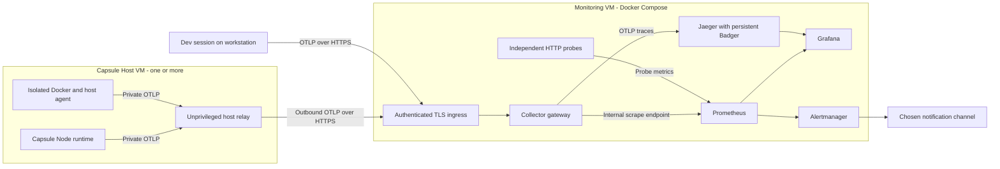

# Sporades OpenTelemetry monitoring plan

Status: specification published as [GitHub issue #107](https://github.com/mgscox/sporades/issues/107), labelled `ready-for-agent`; implementation has not started. Date: 2026-09-27. Updated with the agreed portable Docker Compose distribution and independent monitoring-server configuration.

## Objective and scope

Make a future CPU runaway detectable, and make routine API performance and memory behaviour inspectable across Sporades Capsules. Matt identified `saas-tickets` as the recent incident and confirmed it is fixed. Use it as the proposed first canary, not as an unresolved investigation. The incident host, historical CPU measurement and root cause have not been independently verified.

Deliver continuous container/host metrics, API and runtime-operation traces, process memory/GC/event-loop metrics, correlated existing logs, dashboards, actionable notifications and a tested incident runbook. Default platform instrumentation must require no application imports. Cover Dev sessions, local Container sessions and Hosted Capsules. Browser instrumentation, full centralized log storage, automatic remediation and continuous profiling are separate follow-ons.

OpenTelemetry is the instrumentation and transport layer. Storage, dashboards and alert delivery are separate components. Monitoring will detect and help explain regressions; it does not itself prevent an infinite loop or cap resource use.

## Repository findings

- `CONTEXT.md` and `docs/PRD.md` describe a Node runtime with a Node 22 Alpine base image and the same generated bundles across execution modes. `package.json` supports Node >=22.13 <23 or >=24. This is not a Bun integration.
- The existing deferred proposal, `.scratch/post-v2-platform-hardening-and-ops/issues/04-add-automatic-opentelemetry.md`, already calls for automatic instrumentation, project/CLI configuration and local-first operation without a collector. This plan develops that marker. Do not silently mark the historical issue complete.
- `src/templates/server-bundle-entry.ts:154` owns generated HTTP dispatch and its shutdown path; local Dev HTTP handling also exists in `src/cli/sporades.ts:2198`. Both must use the same instrumentation implementation.
- `src/server-runtime-source.ts:3510` owns custom endpoint dispatch. Current endpoints match declared method/path exactly; use the declared path as the route identity. Built-in routes containing IDs need explicit stable templates. Do not introduce a new parameterized router just for tracing.
- `src/http-runtime.ts:703` owns `/__sporades/health/runtime`. It requires the host probe token and returns opaque 404s for unauthenticated probes. Preserve that contract.
- `src/cli/sporades-host-helper.ts:4202` normalizes on-demand Docker CPU, memory, I/O and PID statistics. These are useful inspection data, not a continuous history or alert service.
- `src/log-envelope.ts` and `createRuntimeLogSink` in `src/server-runtime-source.ts:2409` already provide JSONL, bounded log indexing, optional stdout and request/correlation fields. Extend these seams rather than adding another application logger.
- `src/templates/server-bundle-module-graph.ts` emits self-contained ESM and rejects non-builtin external dependencies. OTel packages must survive this build contract; assuming Node monkey-patching automatically works after bundling is unsafe.
- `src/cli/project-config.ts` has a strict top-level key allowlist; any new telemetry policy must be deliberately added and validated. Source, shipped `dist/`/`bin/`, declarations, generated manifest and canonical docs must stay in parity when implemented.
- The canonical LAN inventory was read from Tower and matched the local working copy. No monitoring deployment or spare capacity was verified. Choose backend placement during the pilot inventory; do not assume Tower is automatically the correct failure domain.

## Recommended architecture

Ship a versioned, self-hostable Docker Compose monitoring stack that any Sporades operator can run on their own infrastructure. A **Monitoring server** is independent of a **Host server**: one stores and presents telemetry; the other runs Capsules. One Monitoring server can receive telemetry from several Host servers. They may share a VM for small installations, but separate VMs must be a first-class, tested topology. No dependency on Matt's LAN, a particular cloud provider, Tailscale, or an existing Sporades Host installation on the Monitoring server.



**Initial self-hosted default:** pinned Collector contrib, Prometheus, Grafana, Alertmanager, Blackbox exporter and Jaeger v2 with persistent Badger for modest trace volume. Jaeger provides trace storage and investigation; Grafana provides the fleet dashboard. Badger is a single-node choice, not high availability. Benchmark volume and retention before committing production capacity. [Jaeger storage documentation](https://www.jaegertracing.io/docs/2.21/storage/badger/)

If existing infrastructure already provides supported production object storage, Tempo is a reasonable alternative. Its monolithic mode can run without Kafka, but production object storage and the pinned version's requirements need verification. Keep the runtime OTLP contract independent of the selected backend. Do not deploy both trace backends. [Tempo deployment planning](https://grafana.com/docs/tempo/latest/set-up-for-tracing/setup-tempo/plan/)

Run metrics collection outside each application process, once per Docker host. Keep Docker-accessing collection isolated from application-facing OTLP ingress: use a constrained Docker API proxy or an export-only privileged agent with no inbound OTLP listener. A read-only socket mount does not make Docker API access read-only. Never mount the Docker socket into a Capsule. The `docker_stats` receiver is currently alpha; pin it and verify its metrics against the actual Linux/cgroup setup. On Docker Desktop, explicitly verify Linux VM and physical-host coverage separately. [Docker stats receiver](https://github.com/open-telemetry/opentelemetry-collector-contrib/blob/main/receiver/dockerstatsreceiver/README.md)

Put alert evaluation and at least one application probe outside the monitored host where practical. A dedicated container on the same host protects against an app-process failure, but not host failure. Restrict OTLP, scrape, storage and dashboard endpoints to authenticated private access; no unauthenticated public metrics endpoints. Use one ingestion path per metric family to avoid duplicates.

## Portable Compose distribution

The distribution must include `compose.yaml`, pinned component configuration, provisioned Grafana data sources/dashboards, Prometheus rules, notification configuration templates, persistent volumes, health checks, backup/restore and upgrade/rollback instructions. Include an authenticated TLS ingress with a documented option to use an existing reverse proxy. Publish the package as a versioned release asset and make the Sporades CLI able to materialize it into an operator-owned directory. Images must be published for each supported architecture, or installation must reject an unsupported platform explicitly. Document minimum Compose/Engine versions and measured memory/disk requirements.

Use an operator-owned `.env` beside `compose.yaml` as the standard stack configuration and secret source. Assume this file is available and may contain all credentials needed by Compose, including dashboard administration, ingestion authentication and notification-provider secrets. Ship a documented `.env.example` with placeholders and non-secret defaults, plus a `.gitignore` excluding `.env`; never ship working default passwords or tokens. Cover monitoring hostname, listener/bind policy, TLS mode, retention/disk budgets and notification routing in the same configuration contract. Operators should not need to edit six unrelated vendor configuration files.

Stack initialization and regeneration preserve existing `.env` values, including unknown operator additions, and report missing required keys by name without printing values. Never rotate or replace an existing secret implicitly. For a new installation, setup may generate unique values for missing stack-owned secrets and write them to `.env`; externally issued credentials remain operator-supplied. Create generated secret-bearing files with restrictive permissions and keep values out of CLI/JSON diagnostics, source control and exported connection descriptors. Diagnostics must not print resolved Compose configuration containing interpolated secrets.

Compose may interpolate `.env` values into the service configuration or pass explicitly selected keys as service environment variables; do not inject the entire `.env` into every container. Where a component requires a credential file, generate that protected file from the same `.env` source. Separate Compose secret management is optional, not an installation prerequisite. TLS certificate/key files may still be mounted by paths configured in `.env`. Keep a user-owned Compose override file separate from regenerated configuration. Document backup/restore of `.env` alongside persistent data, keeping secret-bearing backups private.

Only authenticated ingress/dashboard access and the minimal `GET /health` readiness endpoint are externally reachable by default. Prometheus, Jaeger storage/query ports, Alertmanager, raw Collector ports and Docker APIs remain internal to the stack. A loopback-only development mode is permitted; remote mode requires verified TLS. Support a supplied certificate/private CA or an existing TLS proxy so installation does not require public DNS or automatic certificate issuance. Never silently disable certificate verification.

A second, lightweight Host-side agent/relay configuration runs beside Capsules on every monitored Host. The central stack cannot read a remote VM's Docker socket or host filesystem. Host agents initiate outbound HTTPS to the Monitoring server, so central collection does not require inbound scrape ports or remote Docker access on Capsule Hosts. The central gateway exposes received metrics for Prometheus to scrape within the monitoring Compose network. Keep app-facing relay and Docker access separated as described above.

Configure the Capsule-to-relay Docker network/address explicitly through Sporades lifecycle wiring; `localhost` inside a Capsule is not the Host or Monitoring VM. The relay has the central ingestion credential; Capsules receive only scoped local connection material where required. Remote monitoring must continue after the configuring workstation disconnects.

The package is independently runnable using ordinary `docker compose` commands. Sporades generates and validates its configuration and connections; a Monitoring server does not need to be registered as a Capsule Host. The first release need not provision arbitrary VMs or remotely administer the stack over SSH.

## Sporades connection and lifecycle contract

Introduce an operator-owned **Telemetry profile**, separate from a Host profile. It describes a named monitoring installation: OTLP/HTTP base URL, dashboard URL, protocol, TLS trust reference, ingestion credential reference and configuration version. An exportable descriptor contains only non-secret connection metadata. Credentials are supplied separately through the existing protected server configuration mechanism. Resolve profile references before deployment; persist the resolved binding on the Host so it never depends on a workstation-local alias at runtime.

Proposed CLI workflow; these command names are design candidates, not existing commands:

```sh
# Generate the portable stack directory, then run Compose on its chosen VM.
sporades telemetry stack init ./monitoring

# Register a connection from the operator's workstation; import secrets separately.
sporades telemetry add production --connection ./monitoring-connection.json

# Configure that Host's shared agents and default destination for its Capsules.
sporades host telemetry configure --host apps-eu --profile production

# Select the connection for an explicit local Dev or Container session.
sporades dev --telemetry-profile production
sporades deploy --telemetry-profile production

# Check the saved binding and actual delivery from the Host, not just the laptop.
sporades host telemetry check --host apps-eu --json
```

Required behaviours:

- Stack initialization writes a reviewable bundle, prerequisite checks and next-step commands. It does not silently provision a VM, open public ports or start services. On rerun, preserve secrets, persistent data and operator overrides; report version/schema differences before regeneration.
- Host configuration installs or reconciles one shared agent/relay set per Host using the existing authenticated Host-helper and registry lifecycle. Persist destination, credential/trust references, collection policy and identity in Host-owned configuration. Same-VM and remote-VM installations use this identical model.
- Connecting a Host enables monitoring for all existing and newly deployed Capsules by default, with explicit per-Capsule opt-out. Apply enabled/disabled signal policy when generating runtime inputs across start, restart, push and rollback; never require app code or per-app Compose edits. Report existing Capsules as pending if activating monitoring requires a controlled restart, until coverage is actually verified. Disabling one Capsule must not disable collection for others. Local Dev and Container sessions remain opt-in.
- Keep signal policy and sampling in validated `sporades.json` configuration; keep destination selection and secrets in operator/Host configuration. A project cannot redirect a Hosted Capsule to an arbitrary collector or override its operator's disabled/export policy. Explicit per-Capsule destination overrides, if included, require the same Host operator authority and reference another approved profile.
- For local Dev/Container sessions, precedence is explicit session profile, operator's project binding, then no exporter. Hosted sessions resolve through their persisted Host binding. Do not introduce a machine-wide implicit export destination that silently starts exporting unrelated projects.
- Health/check output separates configuration validity, host-agent state, DNS/TLS/authentication from the actual sender, OTLP acceptance, recent ingestion and backend query visibility. A laptop connection or a successful HTTP response does not prove stored telemetry. Where backend query verification is unavailable, report it as unverified rather than requiring an application ingestion credential to read the entire backend.
- Issue independently revocable ingestion credentials per Host/workstation, with a documented rotate/revoke flow. Host-held ingestion credentials must not grant dashboard administration or cross-host query access. Bound certificate/credential reloads and verify resumed export after rotation.
- A Monitoring server belongs to one operator/trust domain in v1. Serving unrelated customers from a single backend would require a separate tenant-isolation design; labels alone are not authorization boundaries.
- Require automatic lifecycle synchronization in v1 through a small authenticated inventory interface. Initial Host connection, registration, deploy, start/restart/rollback, stop, delete, opt-out and address changes update sanitized expected-Host/Capsule identities, lifecycle state and public probe targets from the authoritative Host registry. Scope update authority to the exact Host, use idempotent versioned updates and reject stale revisions. Keep acknowledged expectations durable centrally: lost contact never implicitly deletes an expected Host. Persist pending desired state and reconcile periodically after outages without blocking Capsule operations or relying on the workstation. Expose last successful sync and pending/stale state. Manual export/import is for recovery, not normal operation.
- Keep the private readiness token on the Capsule Host. A local probe reports readiness through the relay, while the Monitoring server independently probes the uncached public application path. Neither central probing nor stack installation exposes the protected runtime health route.
- Backend/network outages produce bounded local queues and observable loss, not failed Capsule availability or unbounded retries. Recovery retries automatically. Same-VM installs explicitly disclose that a whole-VM outage also takes down local alerting.
- Expose Monitoring server `GET /health`: HTTP 200 with `{"ok":true}` when the telemetry ingestion pipeline and metric/trace storage are ready, otherwise HTTP 503 with `{"ok":false}`. Bound dependency checks and reveal no internals. The minimal route can be called without admin credentials; existing protected Capsule readiness is unchanged. No watchdog, outbound heartbeat or external uptime integration ships in v1. A health endpoint alone cannot deliver an alert when the Monitoring server is down.

Document this as a first-class Sporades feature in the CLI reference, configuration schema, Host operations guide and installation guide. Include diagnostics, rotating credentials, migration to a new monitoring endpoint, disabling monitoring, preserving history, and uninstalling Host agents without touching Capsule data. Expose structured `{ ok, data, error }` results in the existing CLI style.

## Signals and instrumentation

| Layer | First-release coverage | Diagnostic purpose |
| --- | --- | --- |
| HTTP/API | Request count, duration histogram, status/error count, in-flight count; one SERVER span per request | Which route became slow or started failing, and when |
| Runtime operations | Child spans for endpoint handlers, auth, database operations, outbound HTTP, file operations; bounded names | Separate application work from storage, dependencies and runtime overhead |
| WebSocket operations | Active connections, operation count/duration/errors, operation spans | Cover queries/mutations that do not appear as separate HTTP requests |
| Jobs | Queue depth, oldest pending age, execution duration, retries/failures, execution spans | Detect expensive background work while API traffic is quiet |
| Node process | CPU time, RSS, heap used/allocated/limit, external memory, ArrayBuffers, uptime | Separate process growth from V8 heap pressure |
| Node runtime | Event-loop delay/utilization, GC count/duration, heap-space data where supported | Distinguish blocked JS, allocation churn and normal workload |
| Container | CPU cores consumed, quota saturation, throttling, memory/limit, OOM/restarts, network/block I/O, PIDs | Catch resource saturation independently of application telemetry |
| Host | CPU/load, available memory, disk free/inodes, I/O and network | Distinguish one Capsule from machine-wide contention |
| Monitoring | Agent freshness, expected-container presence, exporter failures/drops/queues, backend disk and availability | Detect lost visibility rather than treating missing data as healthy |

Obtain restart/OOM/presence information from verified Docker lifecycle/inspect or event collection; do not assume every desired lifecycle metric exists in `docker_stats`. Reconcile expected running Capsules with lifecycle state so intentional stops do not page.

**HTTP lifecycle:** start context before dispatch; record one terminal completion on response finish or premature close/abort. Streams stay open until the response completes. Errors caught and converted into HTTP responses must still set the correct outcome. Cover early security rejection, malformed targets, auth/file/custom routes, 404, cancellation and exceptions. Route names come from declared routes or built-in templates, never concrete IDs/raw URLs. Keep unknown routes in a bounded fallback category. The OTel HTTP convention expressly forbids substituting a raw URL path for a low-cardinality route. [HTTP conventions](https://opentelemetry.io/docs/specs/semconv/http/http-spans/)

**Shared runtime module:** introduce a narrow internal telemetry module owning provider setup, context propagation, instruments, filtering, batching and shutdown. Use explicit runtime spans first; selectively adopt outgoing HTTP/fetch instrumentation only after a packaged-bundle test proves it works and avoids duplicates. Initialize before instrumented work, and dispose timers/providers on Dev restart. OTel documents ESM setup considerations. [JavaScript instrumentation](https://opentelemetry.io/docs/languages/js/libraries/)

**Operation boundaries:** database spans report bounded engine/operation/table metadata and duration, never SQL values or parameters. Preserve transaction and authorization behaviour. Treat WebSocket operations individually rather than keeping a span open for the entire connection. Job execution gets its own span; persist only validated trace context for a causal link to enqueueing, not a span left open across hours of queue time. Cover SQLite and PostgreSQL and keep adapter instrumentation engine-neutral.

**Memory interpretation:** graph container usage against its limit, process RSS and V8 heap separately. Include external/ArrayBuffer memory, but do not sum ArrayBuffers into external again: Node already includes it there. Collect periodically, not per request. Shared process memory and GC make before/after request heap deltas unsuitable for attributing memory consumption to a route. Correlate traces with growth, then use controlled CPU/heap profiling for diagnosis. Profiling is not supplied by ordinary request tracing. [Node memory API](https://nodejs.org/api/process.html#processmemoryusage)

**CPU interpretation:** display consumed cores, host utilization and quota saturation separately. Docker 100% generally represents approximately one logical CPU; it does not prove the entire host was saturated. Derive cores from cumulative CPU time with correct units and reset handling. Where a quota is known, divide by the effective limit; show unlimited/unknown otherwise. A Node main thread can saturate one core despite low whole-host utilization. Pair process CPU with event-loop delay and latency. [Docker CPU calculation](https://github.com/docker/cli/blob/master/cli/command/container/stats_helpers.go)

**Logs:** propagate stable request ID plus trace/span IDs into the existing envelope using an explicitly documented additive contract that preserves existing correlation data. Update payload-cap accounting and parser parity tests. Retain existing redaction, JSONL, stdout and bounded index behaviour. Keep full central log ingestion/Loki as a separate decision; the first release must let an operator use a trace ID to find related existing logs. No new audit authority for app code.

## Configuration, data policy and operational budgets

Proposed product surface, not implemented syntax:

- A validated `telemetry` project section controls enabled signals, deployment environment, metric interval and trace sampling. Capsule identity comes from the runtime; release/instance/host identity is attached by trusted lifecycle configuration.
- Destination selection follows the Telemetry profile and persisted Host-binding rules above; signal policy follows explicit operator override, project policy, then defaults within Host-enforced constraints. Deliver credentials only through protected server configuration, preferably to the shared Host relay. Never bake exporter credentials into generated bundles or browser code, and keep URLs free of embedded credentials.
- No collector configured means no network export and no exporter retry loop; ordinary Capsule execution and existing logs work unchanged. Invalid opted-in configuration produces a clear CLI validation error. A valid destination becoming unavailable must not block application startup, requests, jobs or shutdown.
- Start the low-volume canary with 100% traces and unsampled request metrics for a short measured pilot. Metrics remain independent of tracing thereafter. Configure probabilistic trace sampling after measuring volume. Head sampling cannot promise retention of every error or slow trace; add bounded tail sampling only if that guarantee is required and collector capacity is budgeted. [Sampling](https://opentelemetry.io/docs/concepts/sampling/)
- Start infrastructure/process collection at 15-second intervals. Proposed retention: metrics 14 days, traces 3 days, each with measured disk caps and free-space headroom. Estimate capacity from observed points/sec, spans/sec and bytes/span rather than guessing a server size.
- Bound SDK queues, span/attribute counts and values, export timeout, retries, Collector memory, batch size and persistent queue disk. On overload, drop telemetry with observable counters instead of blocking business work. Collector retries/WAL reduce loss but cannot guarantee delivery through full disks or indefinite outages. [Collector resilience](https://opentelemetry.io/docs/collector/resiliency/)
- Use bounded resource/metric dimensions: Capsule/service, environment, host, instance, declared route, method, status and operation type. Keep release metadata available for correlation without repeating unnecessary dimensions on every series. Trace IDs belong in traces/logs/exemplars, not metric labels.
- Exclude request/response bodies, credentials, probe tokens, cookies, raw query strings, SQL parameters, user/email/team IDs and arbitrary environment/Docker labels by default. Sanitize exception messages/stacks before export. Validate incoming trace context, do not treat baggage as authority, and prevent remote sampled flags from bypassing operator volume controls. Propagate context only to approved outbound destinations.

## Dashboards and starting alerts

Provide four saved views: fleet health; one Capsule's API latency/errors and traces; process/container CPU and memory; telemetry pipeline health. Include deployment/restart annotations and links from an alert to the affected Capsule and time range. Percentiles come from request-duration histograms, not averages or sampled traces.

These are initial thresholds to tune after baseline collection, not existing SLOs:

| Alert | Starting condition | Treatment |
| --- | --- | --- |
| Runtime unavailable | Independent uncached runtime probe fails for 60 seconds | Critical; distinguish public proxy path from protected local readiness |
| CPU runaway candidate | >90% known CPU quota for 5 minutes, or sustained near-one-core process use with low traffic/event-loop pressure | Warning; escalate with latency/probe failure; account for expected jobs |
| Memory pressure | >85% container limit for 10 minutes; >95% for 2 minutes | Warning/critical; only when limit is known; OOM or restart loop critical |
| API failures | >5% 5xx for 5 minutes with at least 100 requests in that window | Critical; use probes/absolute counts for quiet services |
| API latency | p95 above a per-route budget for 10 minutes with sufficient samples | Warning; initial interactive-route budget 1 second, exclude deliberate long streams |
| Lost monitoring | Expected agent, Capsule or ingestion heartbeat absent for 2 minutes | Critical visibility failure; distinguish intentional stop/deploy |
| Monitoring capacity | Export drops, sustained high queues, low backend disk | Warning before loss; critical if sustained or collection stops |

Prometheus owns rule evaluation; Alertmanager handles grouping, silencing, inhibition and notification routing. Avoid duplicate Grafana rule ownership. Confirm an actual delivery and a recovery notification in the chosen channel. Its destination is an implementation-time choice, not permission to send messages during planning. [Alerting architecture](https://prometheus.io/docs/alerting/latest/overview/)

Protected readiness probing must retain the existing host-probe token contract. A remote public probe should hit an uncached application response and verify expected content, not a static page or Caddy fallback alone. Missing completed spans during a blocked event loop are expected: independent probes/container metrics remain the detector.

## Implementation work packages

| Order | Deliverable and boundary | Completion evidence |
| --- | --- | --- |
| 1 | Inventory pilot host and existing monitoring; spike pinned Node SDK/exporter against real generated `server.mjs`, both supported Node lines and the base image; select backend placement/version | Overlapping requests retain correct context; metrics/traces arrive from the packaged image; no unresolved external imports; resource and retention estimates recorded |
| 2 | Versioned portable monitoring Compose distribution; Host agent/relay package; continuous collection, independent probes, persistent backend, initial alerts and fleet dashboard | Fresh install works on a separate VM with documented inputs; bounded CPU/unavailable-container drills deliver alerts; history survives Compose restart; no remote Docker or inbound Host scrape ports required |
| 3 | Telemetry profiles, stack generation, Host binding/reconciliation/check commands, automatic inventory synchronization, Monitoring health and protected credentials; internal telemetry module, HTTP spans and unsampled route metrics across Dev/Container/Hosted | Saved configuration survives workstation disconnect, Host restart and Capsule redeploy; sender-to-backend delivery verified; rotation/revocation tested; HTTP lifecycle exact; disabled mode exports nothing; Dev reload leaks no providers/timers |
| 4 | Process memory/GC/event-loop metrics and existing-log correlation | Heap and Buffer allocation drills move the correct series; one trace locates related logs; overlapping requests do not cross-correlate; caps/redaction remain intact |
| 5 | Database/outbound spans, WebSocket operation and job instrumentation | Trace explains a slow dependency, a socket mutation and a background job; both database adapters preserve rollback, concurrency and retry semantics |
| 6 | Fault/overhead acceptance, runbook and `saas-tickets` canary | Collector/backend outage stays bounded; blocked-loop warning remains external; real notification/recovery demonstrated; 48-hour canary reviewed |
| 7 | Deliberate rollout to remaining Hosts, automatic Capsule coverage and supported lifecycle documentation | Rebuild and regenerate shipped surfaces; operator enable/disable/rollback procedure verified; retention/sampling tuned from measured data |

Dependencies: 1 precedes 2 and 3; 3 precedes 4 and 5; 2–5 converge at 6; 7 follows successful canary. These are the original planning work packages. The approved implementation breakdown supersedes their granularity and is published as 25 tickets, #108–#132, with 39 native blocking relationships. See [the ticket index](opentelemetry-monitoring-tickets.md) for the authoritative implementation order and dependencies; do not create a second ticket set.

Suggested file ownership for implementation: new `src/telemetry-runtime.ts` and config module; integrate `src/templates/server-bundle-entry.ts`, `src/templates/server-bundle-module-graph.ts`, `src/cli/sporades.ts`, `src/cli/project-config.ts`, `src/cli/sporades-host-helper.ts`, `src/http-runtime.ts`, `src/server-runtime-source.ts`, log-envelope policy, database and job seams. Keep reusable telemetry wiring outside the large runtime file. Place the portable Compose distribution, its settings schema, Host agent assets, configuration generators, `.env.example` and provisioned dashboards together, with versions pinned and no secrets checked in. Include packaged CLI distribution tests so stack assets work from an installed Sporades release, not only this source checkout.

## Acceptance and rollout gates

Run synthetic failures only in a disposable isolated Capsule, never in the repaired production app:

1. CPU burner, delayed request and blocked event loop: container/process graphs identify CPU use; independent probe fails even when app exporters stop; notification arrives within two minutes of a sustained probe failure.
2. Bounded heap and Buffer growth: distinguish heap from external memory and container limit pressure; a controlled OOM/restart records lifecycle evidence without exposing raw payloads.
3. Route success, 404, auth denial, 5xx, thrown error, client abort and streaming response: correct counts/durations and exactly one SERVER span. Concurrent requests must not share context accidentally.
4. Collector stopped, backend disconnected, slow export and full bounded queue: requests/jobs remain functional, telemetry memory/disk stays within configured caps, loss is visible and recovery works. SIGTERM flush is time-bounded and does not compromise existing runtime shutdown.
5. Restart monitoring services and redeploy a Capsule: history persists, discovery updates instance identity and retired instances stop producing false alerts. Test missing expected telemetry separately from successful zero traffic.
6. Seed secrets in headers, body, query parameters, errors, server env and SQL parameters: none appear in exported data or new logs; browser bundle and unauthenticated routes expose no telemetry credentials or administrative data.
7. Compare telemetry off/on using identical representative load. Proposed gate: <=5% p95 latency regression and <=5% throughput loss, plus an explicitly measured fixed and load-dependent memory budget; these are goals to validate, not claimed results. Investigate sustained growth and tune before broad enablement.
8. Clean-install the monitoring Compose bundle on VM B with Capsules on VM A; also test the same-VM topology. Prove Host A exports without an inbound monitoring port and survives workstation disconnect. Restart both VMs independently, rotate and revoke credentials, interrupt the inter-VM network, reconnect and migrate the binding to another endpoint. Verify identity, bounded loss and remote alerting when VM A disappears.
9. Verify automatic target synchronization across Host connection, registration, deploy/start/restart/rollback, address changes, opt-out, stop and delete, without manual import/export. Cover stale/duplicate updates, unauthorized cross-Host changes and sender restarts/outages; lifecycle operations proceed and pending inventory catches up. A missing Host still alerts from durable central expectations. Verify Host-wide default coverage and per-Capsule opt-out, with local sessions still opt-in. Preserve private health-token and local relay access boundaries.
10. Upgrade and restore the monitoring stack from its versioned package and backup. Preserve history, operator overrides and existing `.env` values. Test missing required keys, credentials containing Compose-special characters, and redaction of resolved secrets from diagnostics; document quoting/interpolation rules. Validate supported architectures and capacity guidance on the published images.
11. Verify the Monitoring server minimal health contract in healthy and dependency-failure states, with bounded checks and no watchdog configuration.
12. Build/typecheck, focused tests, real generated-image checks and generated-source parity pass. Update CONTEXT, canonical PRD/reference/operations docs and config/types together; regenerate shipped artifacts from source.

Rollback disables runtime export independently of external host monitoring. Preserve retained evidence and existing Capsule data. No automatic restart-on-CPU policy in this release: add CPU/memory/PID limits and remediation separately after workload measurement and review of the existing bounded restart contract. Resource constraints bound damage but do not fix the code path. [Docker resource constraints](https://docs.docker.com/engine/containers/resource_constraints/)

## Decisions to resolve during implementation

- Actual `saas-tickets` host and rollout mechanism; the app's incident is fixed and needs no reproduction in production.
- Pilot Monitoring VM address, network/TLS route and measured capacity. Portable Compose and separate Monitoring/Host configuration are agreed requirements; only the deployment details remain open.
- Notification destination and per-route performance budgets.
- Whether measured traffic requires tail sampling or a more scalable trace backend.

The specification is published as GitHub issue #107 and its 25 implementation tickets are #108–#132, all labelled `ready-for-agent`. Parent #107 was left unchanged during ticket publication. No production services, application behaviour or deployments were changed; implementation has not started.
