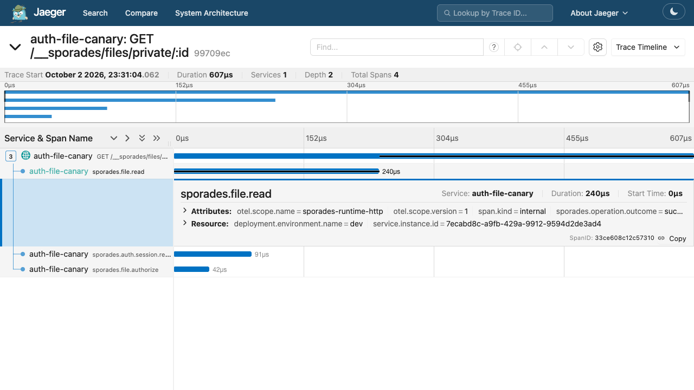
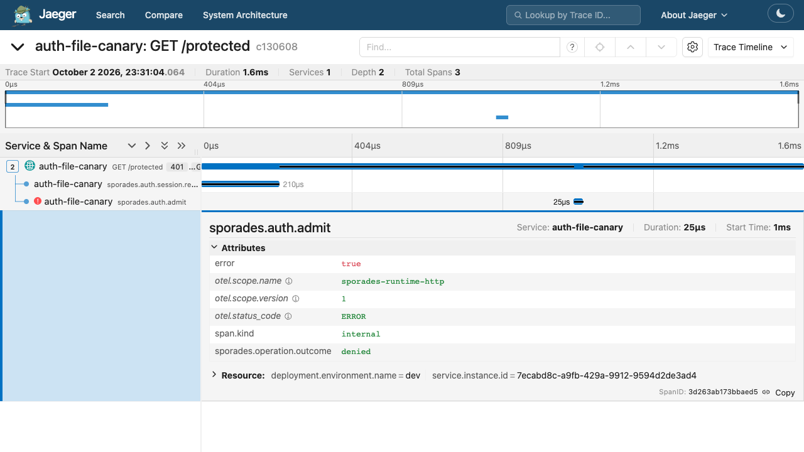

# Authentication and File operation trace verification

Issue #124 was verified on October 2, 2026 with Node 24.19.0, the packed
Sporades 0.9.31 CLI and a generated vanilla Dev Capsule. The disposable local
Jaeger 2.21.0 instance used the repository's `monitoring/trace/jaeger.yaml` and
persistent Badger storage. OTLP ingestion and the query UI were bound to local
ports 19921 and 19922; Dev used port 5203. Operator configuration, the package,
Capsule, runtime data and Badger data were isolated inside this worktree.

The package was produced with `npm pack --ignore-scripts`, extracted into a
fresh directory, and its `bin/sporades.js` generated and ran the Capsule. No
application OpenTelemetry imports or app dependency installation were needed.
The Capsule used the existing Session, email password authentication and
Access-key flows. Its sole custom endpoint used `requireAuth`; File requests
used the existing upload and private File routes. Authentication was local;
no SMTP, OAuth, Stripe or Host service was contacted.

Seven requests were checked against both responses and Jaeger storage:

| Request | HTTP response | Relevant stored children |
| --- | --- | --- |
| Protected endpoint without an authenticated Session | 401, existing opaque auth envelope | Session resolution success; auth admission denied |
| Protected endpoint with the linked owner's Session | 200, `allowed` | Session resolution and auth admission success |
| Upload completion | 200, existing File metadata response | Upload and version-byte write success |
| Private File with its owner's Session | 200, original bytes and immutable private cache policy | Session resolution, File authorization and File read success |
| Private File with a scoped Access key | 200, original bytes and `private, no-store` | Credential resolution, scope admission, authorization and read success |
| Same key after revocation | 401, existing invalid-token response | Access-key credential resolution denied |
| Private File with an unrelated/invalid Session | 404, exactly `Not found` | Session resolution success; File authorization denied |

The final deterministic trace batch contained seven traces and 23 spans.
Request trace IDs shared prefix `d1248f6500d83e8f`; their final byte values were
`01`, `03`, `05`, `06`, `08`, `0a` and `0b`. Those requests supplied a valid
synthetic remote parent to locate each trace deterministically. That external
parent was deliberately not exported. Separate requests without incoming trace
context verified complete root traces in the rendered Jaeger UI:

- Allowed private read: `99709ec2e5af7182811d0bfbd77d8567`, four spans.
- Denied endpoint: `c1306089e83defe5aa2a2106d4cdf32d`, three spans.

Stored traces were scanned for distinct canaries representing Session and
Access-key tokens, key identifiers, user/email/name values, cookies, request
queries, File identifiers, versions, names, paths and bytes; none appeared.
The child outcome was visible without an exception event or private metadata.
Jaeger reported zero browser console errors; its bundled UI emitted seven
upstream component deprecation warnings.

The focused `node --test` suite also exercises a client disconnect while a File
ACL callback is suspended, a thrown ACL exception, a missing storage version,
overlapping requests, key scope denial/revocation, the 32-child request budget,
and identical responses with telemetry enabled and disabled. A local OTLP HTTP
sink stores exported trace batches on disk before assertions. Existing File
transaction and attachment suites retain rollback, compensation, credential
and stream behavior coverage.

The generated artifacts were rebuilt with `npm run build`; typecheck and the
76-test focused suite passed. Full-suite results are recorded in the PR.
The disposable Dev server and Jaeger container were stopped after verification.
This proves the auth/File slice locally; it does not claim a fleet deployment,
full monitoring-stack outage drill or performance canary.
